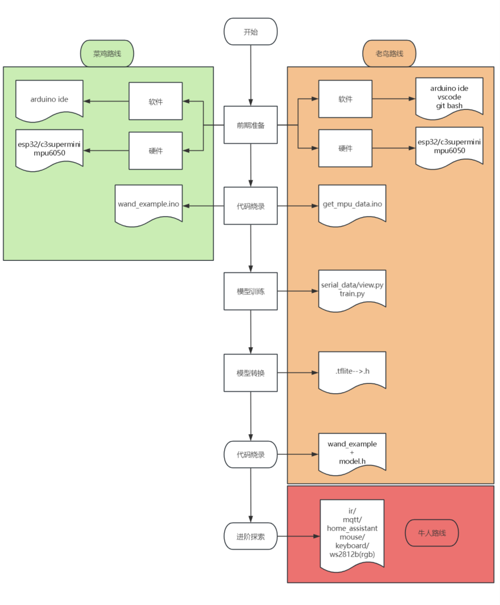

# 🧙‍♂️ ESP32 手势识别魔杖项目

## 项目简介

这是一个基于 **ESP32 + MPU6050** 实现的 **手势识别电子魔杖** 项目。你可以参考本项目的文件，动手制作属于你自己的魔杖！

我还提供了训练代码，你可以根据自己设计的动作“训练法术”。如果你有更好的创意或代码，欢迎交流、学习与分享！

- 📘 [完整项目地址github](https://github.com/dimo333/Electromagic_Wand_ESP32)
- 📘 [完整项目地址gitee](https://gitee.com/dimo666/Electromagic_Wand_ESP32/tree/main)
- 📘 [PCB文件地址oshwhub](https://oshwhub.com/6dimo9/electromagic_wand_esp32)
---

## 🚀 快速开始

我已编写详细的图文教程和环境配置指南：


- 📘 [教程文档github](https://github.com/dimo333/Electromagic_Wand_ESP32/tree/main/docs/tutorial)
- 📘 [教程文档gitee](https://gitee.com/dimo666/Electromagic_Wand_ESP32/tree/main/docs/tutorial)
- 📺 [B站视频教程（基础演示）](https://www.bilibili.com/video/BV1NtwreXEzg)

---

## 🛠 遇到问题？

请尝试以下方法：

1. 仔细检查是否遗漏了教程中的某一步。
2. 复制错误信息，使用搜索引擎或 AI 工具查找答案。
3. 加入 QQ 群：**884880944**。
4. B站后台私信我：[dimo333](https://space.bilibili.com/)。
5. 发送邮件联系我：
   - 📧 dimo333mail@gmail.com（注意拼写）
   - 📧 3180405726@qq.com

---

## ✨ 魔杖具备哪些功能？

魔杖实现了基础的手势识别，基于此可扩展出以下功能：

- 📡 红外信号复制与发送（遥控家电）
- 🖱 模拟鼠标（如飞鼠操作）
- ⌨️ 模拟键盘（快捷输入）
- 📶 蓝牙 / WiFi 通信
  - 可接入 HomeAssistant 实现智能家居联动
  - 接入米家app控制米家设备

---

## 💰 硬件清单与预算

### 🔧 模块连接（推荐入门版）

- 成本约：**15 元**
- 组件清单：
  - ESP32-C3 SuperMini（4MB Flash）
  - MPU6050 陀螺仪模块
  - 按键模块（可选）

### 🛠 自制 PCB（进阶推荐）

- 成本约：**70 元**
- 推荐下单平台：嘉立创 / 立创商城
- 所需内容：
  - PCB 电路板（支持免费打样）
  - PCB 元件
  - 芯片：ESP32-C3FH4、MPU6050 等

---

## 🧞 想直接玩，有没有捷径？

有的，兄弟有的！不想动手，那就动点钱：

- 加入 QQ 群，问问有没有大佬愿意出售焊接好的板子。
- 私聊我，看看我这还有没有多余的现成板子。

---

## 📁 项目结构

```text
├── docs                # 项目文档、图文教程、使用说明
├── Software            # 软件代码（数据收集、训练等）
├── Hardware            # 原理图、电路板设计文件、3D外壳模型等硬件相关资料
├── 3D_Print            # 3D外壳模型
├── lib                # 库文件（如库压缩包、工具函数）
```
---
## 复刻路线


